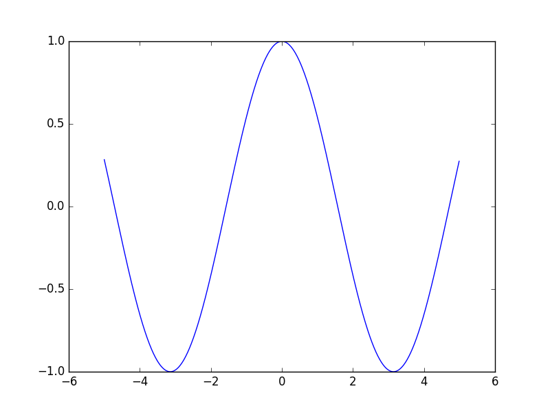

# taylor_series_study
approximate some irrational values using taylor_series with python

#### 2^(1/2) = sqrt(2) 근삿값 구하기 (((1+x)^k)(1, 1/2) 이용)
```
>>> def f(x=1,k=1/2):
...  n=0
...  while True:
...   yield comb(k,n)*(x**n)
...   n+=1
def comb(k,n):
...  m=1
...  for x in range(-n,0):
...   m*=(k+x+1)/(-x)
...  return m
>>> sqrt2=f()
>>> sum(next(sqrt2) for i in range(2000))
1.4142151402182226
```
#### e 근삿값 구하기 ((e^x)(1) 이용)
```
>>> def a_n(x,n):
...  m=1
...  for i in range(n):
...   m *= x/(i+1)
...  return m
... 
>>> a_n(1,0)
1
>>> a_n(1,1)
1.0
>>> a_n(1,2)
0.5
>>> a_n(1,3)
0.16666666666666666
>>> sum(a_n(1,i) for i in range(100))
2.7182818284590455
```
#### cos(pi/3) 근삿값 구하기 (cos(pi/3) 이용)
```
>>> def a_n(x,n):
...  m=(-1)**n
...  for i in range(2*n):
...   m*=x/(i+1)
...  return m
... 
>>> a_n(3.141592/3,0)
1
>>> a_n(3.141592/3,1)
-0.5483111274702221
>>> a_n(3.141592/3,2)
0.05010751541794437
>>> a_n(3.141592/3,3)
-0.0018316338849029745
>>> sum(a_n(math.pi/3,i) for i in range(100))
0.5000000000000001
```
#### 원주율 근삿값 구하기 (arctan(1) = pi/4 이용)
```
>>> def a_n(x,n):
...  return (-1)**n/(2*n+1)*x**(2*n+1)
... 
>>> sum(4*a_n(1,i) for i in range(10000000))
3.1415925535897915
```
#### cos(x) (taylor series with c=pi/4, f(x)=(sum n=0 to inf ((-1)^(floor((n+1) / 2) mod 2) 1/sqrt(2) / n! (x-pi/4)^n)))
```
>>> def a_n(x,n):
...  m=1 if math.floor((n+1)/2)%2 == 0 else -1
...  m/=math.sqrt(2)
...  for i in range(n):
...   m*=(x-math.pi/4)/(i+1)
...  return m
... 
>>> a_n(math.pi/3,0)
0.7071067811865475
>>> a_n(math.pi/3,1)
-0.18512012242326517
>>> a_n(math.pi/3,2)
-0.024232167359857202
>>> a_n(math.pi/3,3)
0.0021146555266190483
>>> sum(a_n(math.pi/3,i) for i in range(100))
0.5000000000000001
>>> x = np.arange(-5, 5, 0.01)
>>> plt.plot(x, sum(a_n(x,i) for i in range(1000)))
[<matplotlib.lines.Line2D object at 0x11694e8d0>]
>>> plt.show()
```

